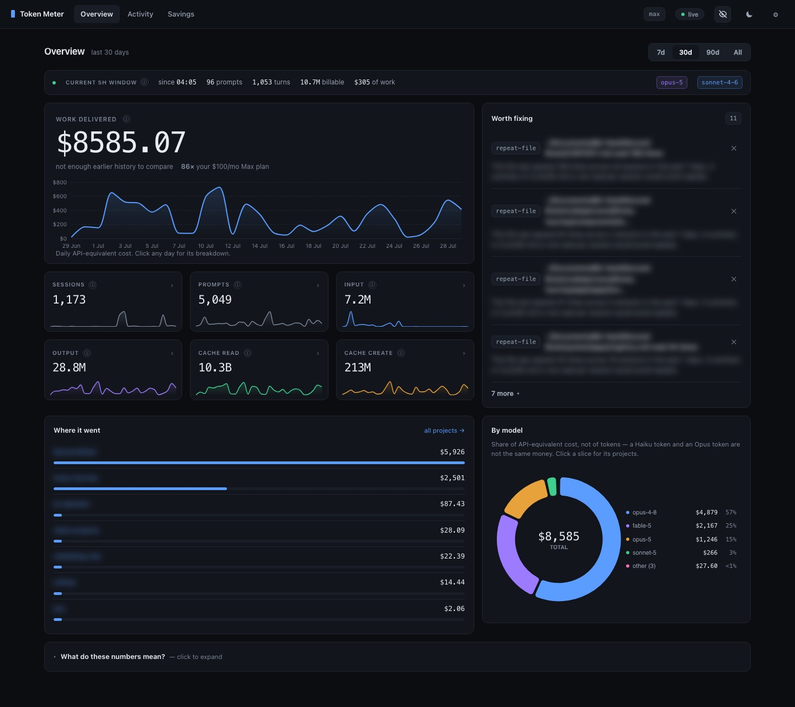
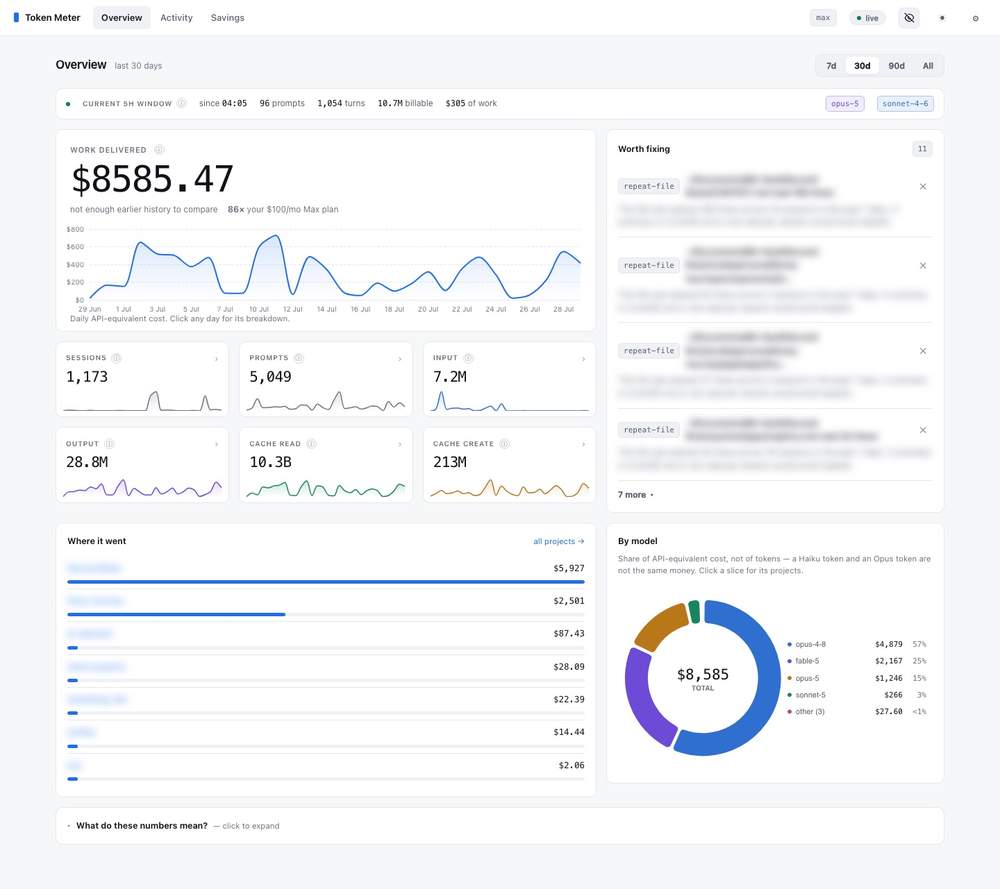
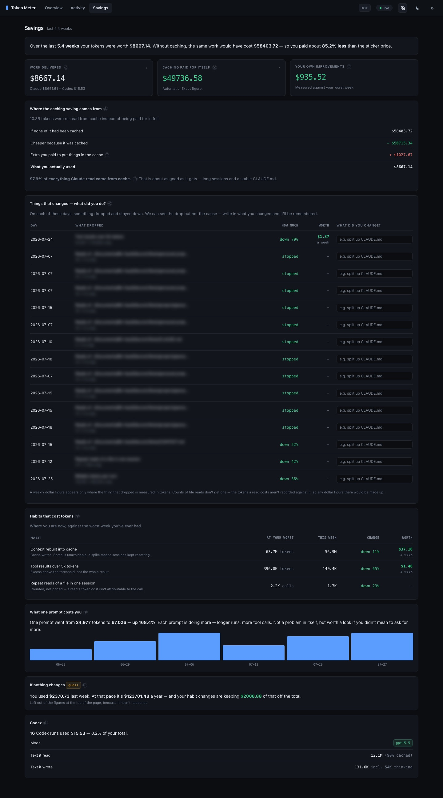

# Token Meter

A local dashboard that reads the JSONL transcripts Claude Code writes to `~/.claude/projects/` and turns them into per-prompt cost analytics, tool/file heatmaps, subagent attribution, cache analytics, project comparisons, and a rule-based tips engine.

**Everything runs locally.** No data leaves your machine — no telemetry, no API calls for your data, no login.



Light and dark, switched from the header and remembered per machine. With no saved choice it follows your OS.





> Project names and file paths in these screenshots are blurred by the app's own privacy toggle (`⌘/Ctrl + B`), not edited afterwards.

## What this is useful for

- Seeing which of your prompts are expensive (surprise: they usually involve large tool results).
- Comparing token usage across projects you've worked on.
- Spotting wasteful patterns — the same file read twenty times in a session, a tool call returning 80k tokens.
- Understanding what a "cache hit" actually saves you.
- If you're on Pro or Max, confirming you're getting your money's worth in API-equivalent dollars.

## Prerequisites

- **Python 3.8 or newer** — already installed on macOS and most Linux. On Windows: `winget install Python.Python.3.12` or download from python.org.
- **Claude Code** — installed and with at least one session run. The dashboard reads those sessions. If you just installed Claude Code and haven't used it yet, run at least one prompt first.
- **A web browser.** Any modern one.

No `pip install`. No Node.js. No build step.

## Quickstart

```bash
git clone https://github.com/nateherkai/token-dashboard.git
cd token-dashboard
python3 cli.py dashboard
```

> On Windows, if `python3` isn't on your PATH, substitute `py -3` for `python3` in every command below.

The command:
1. Scans `~/.claude/projects/` (first run can take 20–60 seconds on a heavy user's machine).
2. Starts a local server at http://127.0.0.1:8080.
3. Opens your default browser to that URL.

Leave it running; it re-scans every 30 seconds and pushes updates live. Stop with `Ctrl+C`.

## Where the data comes from

Claude Code writes one JSONL file per session here:

| OS | Path |
|---|---|
| macOS / Linux | `~/.claude/projects/<project-slug>/<session-id>.jsonl` |
| Windows | `C:\Users\<you>\.claude\projects\<project-slug>\<session-id>.jsonl` |

The dashboard never modifies those files — it only reads them and keeps a local SQLite cache at `~/.claude/token-dashboard.db`.

To point at a different location:

```bash
python3 cli.py dashboard --projects-dir /path/to/projects --db /path/to/cache.db
```

### Environment variables

| Var | Default | Purpose |
|---|---|---|
| `PORT` | `8080` | Port the local web server listens on |
| `HOST` | `127.0.0.1` | Bind address. Keep the default. Setting `0.0.0.0` exposes your entire prompt history to anyone on your local network — don't do this on any network you don't fully control (no coffee-shop Wi-Fi, no coworking spaces). |
| `CLAUDE_PROJECTS_DIR` | `~/.claude/projects` | Where to scan for session JSONL files |
| `TOKEN_DASHBOARD_DB` | `~/.claude/token-dashboard.db` | SQLite cache location |

Pricing lives in [`pricing.json`](pricing.json). Edit it directly if model prices change or to add a new plan — **the server reads it once at startup**, so restart the dashboard afterwards rather than just reloading the page. The Settings tab renders the whole table, including the tier fallbacks used for models with no exact entry.

A model that matches neither an exact entry nor a tier is **not** silently costed at zero — it's listed as a gap on the Overview and Savings tabs with its token count, so the hole is visible rather than quietly wrong.

## CLI reference

```bash
python3 cli.py scan          # populate / refresh the local DB, then exit
python3 cli.py today         # today's totals (terminal)
python3 cli.py stats         # all-time totals (terminal)
python3 cli.py tips          # active suggestions (terminal)
python3 cli.py glance        # one JSON bundle for external panels (machine output)
python3 cli.py dashboard     # scan + serve the UI at http://localhost:8080

# dashboard flags
python3 cli.py dashboard --no-open   # don't auto-open the browser
python3 cli.py dashboard --no-scan   # skip the initial scan (use cached DB only)
```

Change the port: `PORT=9000 python3 cli.py dashboard`.

## The tabs

Three, plus a gear. Each view is backed by its own JSON API under `/api/`:

- **Overview** — the landing tab. The headline is the period's **estimated cost** — what the work would have cost at pay-as-you-go API rates. On a subscription that isn't money you spent, so the line underneath puts it in proportion: *85× your $100/mo Max plan*, the same shape as ROAS, read the same way. On `api` billing there's no subscription to divide by and the multiple is left off. Below it, the daily cost trend and how the period compares with the one before it; six stat tiles (sessions, prompts, input, output, cache read, cache create) each with their own sparkline; spend ranked by project; and cost share by model. Alongside it, **Worth fixing** — the rule-based suggestions (repeated file reads, oversized tool results, low cache-hit rate) that used to live on their own tab, where nothing navigated to them.
- **Activity** — the same spend sliced four ways behind a segmented switch:
  - **Sessions** — every run, newest first. Open one for the turn-by-turn detail with per-turn tokens and tool calls.
  - **Prompts** — individual prompts ranked by tokens or recency. Click a row for the full text and what it cost.
  - **Projects** — per-project cost, sessions, prompts, billable tokens and cache reads.
  - **Skills** — which skills fire most, and what each loads into context when it does. See [limitations](docs/KNOWN_LIMITATIONS.md#skills-token-counts-are-partial).
  - **Tools** — which tools get called, how often, and where from.
- **Savings** — what your optimizations were actually worth. See below.
- **⚙ Settings** — switch pricing between API / Pro / Max / Max-20x so cost figures everywhere reflect your real plan, and read the full rate table.

Old bookmarks still work: `#/prompts`, `#/sessions`, `#/projects`, `#/skills` and `#/tips` redirect to their new homes.

The Overview also carries a "What do these numbers mean?" panel explaining input/output/cache tokens in plain English, and every figure with a caveat carries an ⓘ that states it.

### Drilling in

A strip at the top shows the **current 5-hour window** — prompts, turns, billable tokens and what they'd cost. There is deliberately no "remaining" figure: your cap is never written to disk (`/status` asks Anthropic for it live), so a percentage here would be a guess dressed as a measurement.

Every chart on the Overview is a question you can open, and each opens as a focused layer rather than expanding the page — Escape or ✕ to close:

| Click | You get |
|---|---|
| a day on the cost trend | that day by model, by project, its biggest sessions, and every tool it called |
| a slice of **By model** | which projects used that model, and its day-by-day spend |
| a row or bar in **Activity → Tools** | where that tool is called from, and its day-by-day call count |
| any **stat tile** (sessions, prompts, input, output, cache read, cache create) | that metric split by project, by model, by day, and its biggest sessions |

A day's panel leads with **the prompts that cost the most** — text, project, model, turns and time — so an expensive Tuesday resolves to the handful of prompts that made it expensive.

On **Savings**, the *Work delivered* and *Caching* tiles open the same kind of layer: a Sessions/Prompts switch, a sort control (biggest, newest, oldest, by project), a one-line summary ("the top 12 account for $14,533 of $49,133 — 30%"), and ranked bars so proportion reads without arithmetic. **Show all** swaps in the complete sortable table — every session and every prompt, sortable by any column.

*Your own improvements* has no such list, deliberately: it's a rate measured against your own worst week, so no prompt or session owns any part of it. The endpoint returns 400 rather than manufacture an attribution, and a test holds that line.

### Is the data right?

`python3 tools/audit_data.py`, with the dashboard running. It recomputes every figure a second way — overview totals against raw SQL, each component endpoint summing back to the total, prompt attribution completeness, the savings drill-down reconciling with its headline, every breakdown agreeing with the chart that opens it — and exits non-zero if anything disagrees.

*Saved by your changes* deliberately does not. It's the sum, day by day, of how far under your own worst week you came — a comparison between two rates, not a cost carried by any particular prompt. Clicking it says so and points at the two cards that do decompose it. The endpoint returns 400 rather than manufacture an attribution, and there's a test holding that line.

### Live updates

The scanner picks up new sessions every 30 seconds, and **every tab updates when it does** — figures tick, charts move, and your scroll position is held. The `● live` pill in the header pulses each time.

Updates wait rather than interrupt: while a breakdown is open or you're typing in a field, the pill reads **new data** and the refresh lands the moment you close or click away.

### Header controls

| Control | What it does |
|---|---|
| `api` / `max` pill | The billing mode cost is shown in. Change it in Settings. |
| ● live | Green when the page is updating itself. Click when it reads **new data** to pull changes into a view that doesn't auto-refresh. |
| eye-off icon | Blurs prompt text, project names and file paths — for screenshots and screen-shares. Also `⌘/Ctrl + B`. |
| ☀ / ☾ | Light or dark. Remembered on this machine; follows your OS until you choose. |

## Savings

The Savings tab answers "what did all that optimizing actually buy me", and is careful about which figures deserve to be believed:

- **Exact** — prompt caching. Cache reads bill at a tenth of input and writes bill at a premium, so the net saving is arithmetic on measured tokens and published rates. Nothing to argue with.
- **Attributed** — waste avoided against *your own worst week*. Both ends are measured, but it assumes you'd otherwise still be running at your peak rate, which is unprovable.
- **Forecast** — an annual run-rate, labelled as such and deliberately excluded from the totals.

It also finds **change points**: days when a metric stepped down and stayed down — a file you stopped re-reading, tokens-per-turn falling, cache rebuilds dropping off. The dashboard can see the drop and price it per week; it cannot know *what you changed*, so each one has a box to name it. Labels persist.

Every dollar figure carries an ⓘ explaining exactly how it was computed, including what it excludes.

## Codex

Claude Code's transcripts record that a `codex exec` call happened, not what it cost — those tokens are spent in a separate process. So the scanner also reads Codex's own rollout logs at `~/.codex/sessions/`, which makes skills that delegate to it (`/grill-me-codex`, `/codex-review`) visible in the totals.

Point it elsewhere with `--codex-dir` or `CODEX_SESSIONS_DIR`. If you don't use Codex, the directory won't exist and the scan is a no-op.

Costs there are **API-equivalent**: if your Codex runs go through a ChatGPT subscription, it's what those tokens would have cost on the API, not money you were charged.

## The glance bundle

`python3 cli.py glance` prints a single JSON object on stdout — today's totals, all-time totals, a 14-day daily series, the five heaviest projects, the top tips, and the three most recent sessions. It reads the SQLite cache directly, so it works with nothing listening on port 8080:

```bash
python3 cli.py glance | python3 -m json.tool
```

It exists for external panels that want one fetch instead of a handful of separate endpoints. Here it feeds the ADA HUD's `/tokens` view (`lib/tokens.ts` in the `ada-hud` repo shells out to this command). Nothing but JSON goes to stdout, so it pipes cleanly.

## Troubleshooting

**"No data" or empty charts.** Run `python3 cli.py scan` once to populate the DB, then reload.

**Port 8080 already in use.** `PORT=9000 python3 cli.py dashboard`.

**Numbers look wrong / stuck.** The DB lives at `~/.claude/token-dashboard.db`. Delete it and re-run `python3 cli.py scan` to rebuild from scratch.

**Running the dashboard twice at the same time.** Don't — both processes will fight over the SQLite DB. Stop all instances before starting a new one.

## Accuracy note

Claude Code writes each assistant response 2–3 times to disk while it streams (the same API message gets snapshotted as output grows). The dashboard dedupes these by `message.id` so the final tally matches what the API actually billed. If you compare against another tool that sums every JSONL row, expect this dashboard's numbers to be lower — and closer to reality.

## Privacy

Nothing leaves your machine. No telemetry. No remote calls for your data. The browser fetches its JSON from `127.0.0.1`, and all JS/CSS/fonts are served from that same local server — ECharts is vendored into `web/`, and the UI falls back to system fonts rather than pulling from a font CDN. If you want to verify: `grep -r "https://" token_dashboard/ web/` — you'll find nothing.

## Tech stack

Python 3 (stdlib only) for the CLI, scanner, and HTTP server. SQLite for the local cache. Vanilla JS + ECharts for the UI, no build step. Dark theme, hash-based router, server-sent events for live refresh.

Data flow: `cli.py` → `token_dashboard/scanner.py` → SQLite DB; `token_dashboard/server.py` exposes `/api/*` JSON routes and serves `web/`.

## Further reading

- [`CLAUDE.md`](CLAUDE.md) — conventions and architecture overview (also picked up automatically by Claude Code)
- [`CONTRIBUTING.md`](CONTRIBUTING.md) — how to develop and test
- [`docs/KNOWN_LIMITATIONS.md`](docs/KNOWN_LIMITATIONS.md) — rough edges
- [`docs/inspiration.md`](docs/inspiration.md) — prior art and how this project diverges

## Contributing

See [`CONTRIBUTING.md`](CONTRIBUTING.md). Short version: fork, `python3 -m unittest discover tests` before opening a PR, keep it stdlib-only.

## License

[MIT](LICENSE).
